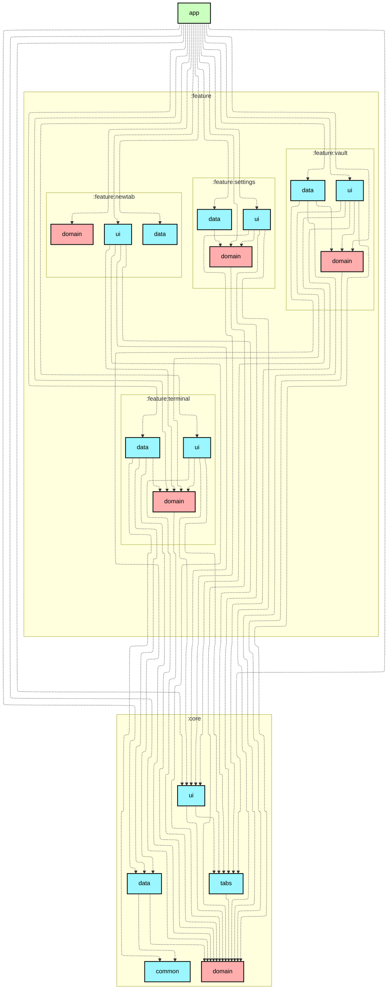

# `:app`

## Module dependency graph

<!--region graph-->

```mermaid
---
config:
  layout: elk
  elk:
    nodePlacementStrategy: SIMPLE
---
graph TB
  subgraph :core
    direction TB
    :core:common[common]:::core
    :core:data[data]:::core
    :core:domain[domain]:::domain
    :core:tabs[tabs]:::core
    :core:ui[ui]:::core
  end
  subgraph :feature
    direction TB
    subgraph :feature:vault
      direction TB
      :feature:vault:data[data]:::core
      :feature:vault:domain[domain]:::domain
      :feature:vault:ui[ui]:::core
    end
    subgraph :feature:settings
      direction TB
      :feature:settings:data[data]:::core
      :feature:settings:domain[domain]:::domain
      :feature:settings:ui[ui]:::core
    end
    subgraph :feature:newtab
      direction TB
      :feature:newtab:data[data]:::core
      :feature:newtab:domain[domain]:::domain
      :feature:newtab:ui[ui]:::core
    end
    subgraph :feature:terminal
      direction TB
      :feature:terminal:data[data]:::core
      :feature:terminal:domain[domain]:::domain
      :feature:terminal:ui[ui]:::core
    end
  end
  :app[app]:::app

  :app -.-> :core:data
  :app -.-> :core:domain
  :app -.-> :core:tabs
  :app -.-> :core:ui
  :app -.-> :feature:newtab:data
  :app -.-> :feature:newtab:domain
  :app -.-> :feature:newtab:ui
  :app -.-> :feature:settings:data
  :app -.-> :feature:settings:domain
  :app -.-> :feature:settings:ui
  :app -.-> :feature:terminal:data
  :app -.-> :feature:terminal:domain
  :app -.-> :feature:terminal:ui
  :app -.-> :feature:vault:data
  :app -.-> :feature:vault:domain
  :app -.-> :feature:vault:ui
  :core:data -.-> :core:common
  :core:data -.-> :core:domain
  :core:tabs -.-> :core:domain
  :core:ui -.-> :core:domain
  :core:ui -.-> :core:tabs
  :feature:newtab:ui -.-> :core:domain
  :feature:newtab:ui -.-> :core:tabs
  :feature:newtab:ui -.-> :core:ui
  :feature:newtab:ui -.-> :feature:terminal:domain
  :feature:settings:data -.-> :feature:settings:domain
  :feature:settings:domain -.-> :core:domain
  :feature:settings:ui -.-> :core:domain
  :feature:settings:ui -.-> :core:tabs
  :feature:settings:ui -.-> :core:ui
  :feature:settings:ui -.-> :feature:settings:domain
  :feature:terminal:data -.-> :core:common
  :feature:terminal:data -.-> :core:data
  :feature:terminal:data -.-> :core:domain
  :feature:terminal:data -.-> :feature:terminal:domain
  :feature:terminal:domain -.-> :core:domain
  :feature:terminal:ui -.-> :core:domain
  :feature:terminal:ui -.-> :core:tabs
  :feature:terminal:ui -.-> :core:ui
  :feature:terminal:ui -.-> :feature:terminal:domain
  :feature:vault:data -.-> :core:data
  :feature:vault:data -.-> :core:domain
  :feature:vault:data -.-> :feature:vault:domain
  :feature:vault:domain -.-> :core:domain
  :feature:vault:ui -.-> :core:domain
  :feature:vault:ui -.-> :core:tabs
  :feature:vault:ui -.-> :core:ui
  :feature:vault:ui -.-> :feature:terminal:domain
  :feature:vault:ui -.-> :feature:vault:domain

classDef app fill:#CAFFBF,stroke:#000,stroke-width:2px,color:#000;
classDef domain fill:#FFADAD,stroke:#000,stroke-width:2px,color:#000;
classDef core fill:#9BF6FF,stroke:#000,stroke-width:2px,color:#000;
```

<!--endregion-->
