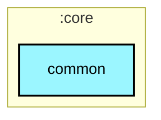

# `:core:common`

## Module dependency graph

<!--region graph-->

```mermaid
---
config:
  layout: elk
  elk:
    nodePlacementStrategy: SIMPLE
---
graph TB
  subgraph :core
    direction TB
    :core:common[common]:::core
  end

classDef app fill:#CAFFBF,stroke:#000,stroke-width:2px,color:#000;
classDef domain fill:#FFADAD,stroke:#000,stroke-width:2px,color:#000;
classDef core fill:#9BF6FF,stroke:#000,stroke-width:2px,color:#000;
```

<!--endregion-->
