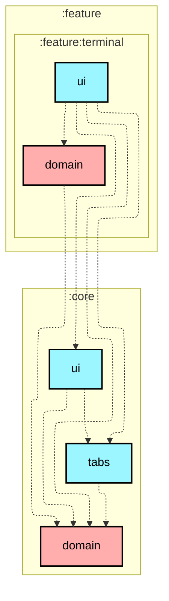

# `:feature:terminal:ui`

## Module dependency graph

<!--region graph-->

```mermaid
---
config:
  layout: elk
  elk:
    nodePlacementStrategy: SIMPLE
---
graph TB
  subgraph :feature
    direction TB
    subgraph :feature:terminal
      direction TB
      :feature:terminal:domain[domain]:::domain
      :feature:terminal:ui[ui]:::core
    end
  end
  subgraph :core
    direction TB
    :core:domain[domain]:::domain
    :core:tabs[tabs]:::core
    :core:ui[ui]:::core
  end

  :core:tabs -.-> :core:domain
  :core:ui -.-> :core:domain
  :core:ui -.-> :core:tabs
  :feature:terminal:domain -.-> :core:domain
  :feature:terminal:ui -.-> :core:domain
  :feature:terminal:ui -.-> :core:tabs
  :feature:terminal:ui -.-> :core:ui
  :feature:terminal:ui -.-> :feature:terminal:domain

classDef app fill:#CAFFBF,stroke:#000,stroke-width:2px,color:#000;
classDef domain fill:#FFADAD,stroke:#000,stroke-width:2px,color:#000;
classDef core fill:#9BF6FF,stroke:#000,stroke-width:2px,color:#000;
```

<!--endregion-->
